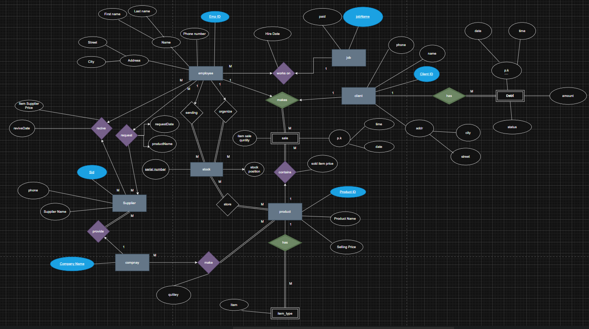

# SMILE Stock – Database Project

A relational database system designed for a stock/inventory management company, covering employees, clients, suppliers, products, sales, and debt tracking.

---

## Overview

SMILE Stock models the core operations of a retail/supply business:

- Employee management with job roles and supervision hierarchy
- Client sales and debt tracking
- Supplier relationships and item requests/receipts
- Product inventory and stock organization
- Company-supplied item types

---

## ER Diagram

The database design is based on the following Entity-Relationship Diagram:



---

## Entities

| Entity       | Description                                               |
| ------------ | --------------------------------------------------------- |
| **Employee** | Staff members with job roles, hire date, and contact info |
| **Job**      | Job titles and associated pay                             |
| **Client**   | Customers who make purchases                              |
| **Debt**     | Outstanding balances owed by clients                      |
| **Supplier** | Vendors who provide items                                 |
| **Company**  | Manufacturers supplying item types                        |
| **Product**  | Items available for sale                                  |
| **Stock**    | Inventory records organized by employees                  |
| **Sale**     | Transactions made by clients                              |

---

## Relationships

- Employee **works on** a Job (M:1)
- Employee **organizes** Stock
- Employee **requests/receives** items from Supplier
- Client **makes** Sale
- Client **has** Debt
- Sale **contains** Product(s)
- Supplier **provides** to Company
- Company **makes** Item Type
- Stock **stores** Product

---

## Files

- `schema.sql` — Full database schema with tables, primary keys, and foreign key constraints
- `ERD.png` — Entity-Relationship Diagram

---

## How to Use

1. Import the schema into MySQL:

```bash
mysql -u root -p < schema.sql
```

2. The database `company_system` will be created with all tables and relationships.

---

## Built With

- MySQL
- ER Modeling

## Author

Baraa — Computer Science Student, An-Najah National University
